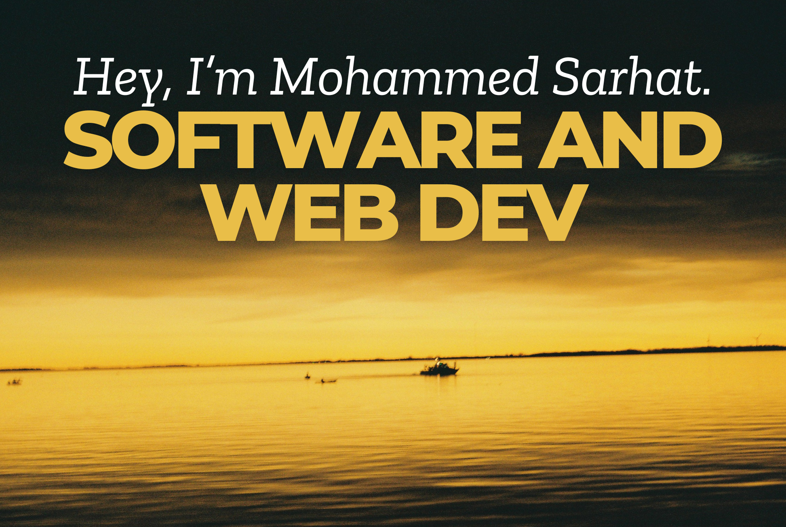

  

  <h1>About Me</h1>

Heyo, I'm Mohammed Sarhat -- a student currently pursuing a degree in **Computing at Queen's University**, slated to graduate in **2026**. I am a Software Engineer for Assertive.

I'm super interested in software development, and system design. I love to go out and take photos on my old film CANON EOS 500 camera (the photo taken above was taken with my camera), spend time with family and friends, and read. 

The following are some clubs I take part in:
- AutoDrive Perception Team (circa 2025), and more to come.

  <h1>What I've Been Working On (Long-Term Projects)</h1>

The following repositories are all for personal use, and document my active learning experience. 

I've made a note to include as many references as I can throughout my documentation. They don't follow a particular citation standard, but links are available for every single topic that I've decided to research. 

- [**JavaScript Practice**](https://github.com/mosarhat/js-practice): I'm taking a deep dive into learning JavaScript. While much of it is review, there's still a lot I don't know, and I'm excited to explore. 
- [**HTML Practice**](https://github.com/mosarhat/html-practice): This is going to be mainly review, but there are topics I'm unaware of. I've decided to include topics regarding accessibiliity, as my brother has Autism, and it's something I want to hold to a super high regard when it comes to designed solutions to problems.
- [**CSS Practice**](https://github.com/mosarhat/css-practice): CSS is probably my weakest link, and I've made an exceptional push to learn as much CSS as I possibly can. This will be exhaustive. 
- [**Vanilla JS Practice**](https://github.com/mosarhat/vanilla-js-practice): I believe understanding Vanilla JavaScript is crucial for building a strong foundation, especially for frameworks like React, Svelte, or Angular. I've used React before, but I want to master the finer details of what precedes it. The repository mainly covers the DOM, and Events.
- [**LeetCode Grind**](https://github.com/mosarhat/leetcode-grind): I'm solving LeetCode problems to improve my problem-solving skills and prepare for technical interviews. While I'm still exploring, I'm committed to consistently improving.
- **System Design and Software Architecture**: A thorough deep-dive into system design, and software architecture topics I've learned. I plan on starting this sometime in the future.

  <h1>Previous Projects</h1>

#### Web Development Projects 

- [**ReceiptPal**](https://github.com/clairewhelan/qhacks_2025): A project developed during **QHacks 2025** that simplifies expense tracking and visualization. Built using **React** for the frontend, **Flask** for the backend, and integrated with **Firebase** for real-time data storage. Utilized **RESTful APIs** for seamless communication between components and **Charts.js** for dynamic and interactive data visualization.

#### Tooling for CLI Projects 

More to come.

#### Bot Projects 

- [Hola!](https://github.com/mosarhat/hola): A simple friendly and relaxed Discord bot built using Python, Discord.Py, and OpenAI’s GPT model. The bot engages in casual conversations with users, powered by OpenAI’s ChatCompletion API. The bot is deployed on Railway.app.

#### JavaScript Specific Projects 

More to come.

#### App Development Projects

More to come. 

  <h1>Statistics</h1>

Here’s a snapshot of my GitHub activity and contributions:

  
  

  <h1>Languages</h1>

  <h1>Backend Frameworks/Databases</h1>

  <h1>Frontend Frameworks</h1>

  <h1>My Contacts</h1>

